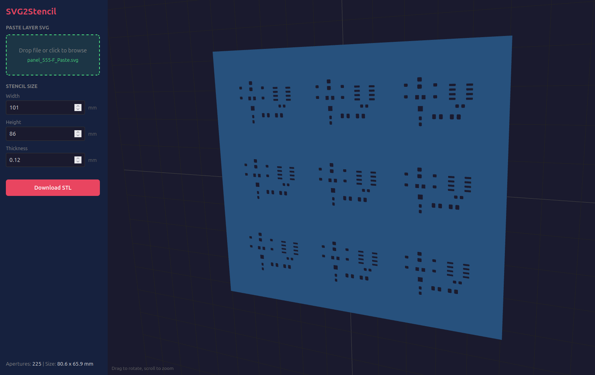

# SVG2Stencil

3D print a solder paste stencil for any circuit board. Export the paste layer from KiCad as a Gerber or SVG file and get a custom STL file you can 3D print.

## Usage

1. Open `index.html` in a browser
2. Export your paste layer from KiCad:
   - **Gerber (recommended):** File > Fabrication Outputs > Gerbers, enable F.Paste
   - **SVG:** File > Plot > F.Paste, select SVG format
3. Drag and drop the file onto the drop zone (or click to browse)
4. Adjust stencil dimensions:
   - **Width/Height**: Overall stencil size (auto-sized to fit with 20mm margin)
   - **Thickness**: Stencil thickness (default 0.12mm)
5. Preview the stencil in the 3D viewer (drag to rotate, scroll to zoom)
6. Click **Download STL** to save

## Supported File Formats

### Gerber (RS-274X)
Accepts `.gbr`, `.ger`, `.gtp`, `.gbp`, and other common Gerber extensions. Supports:
- Standard aperture types: circle (C), rectangle (R), obround (O), polygon (P)
- KiCad's `RoundRect` aperture macro for rounded rectangle pads
- Pre-instantiated aperture macros (KiCad 6+)
- Region fills (G36/G37) for polygon-defined apertures
- Both metric (mm) and imperial (inch) units

### SVG
Accepts `.svg` files exported from KiCad's plot function. Parses filled paths as apertures.

## Requirements

- Modern browser with WebGL support
- No installation or build step required

## Notes

- Apertures smaller than 0.1mm are filtered out
- STL files may need minor repair for 3D printing (most slicers handle this automatically)
